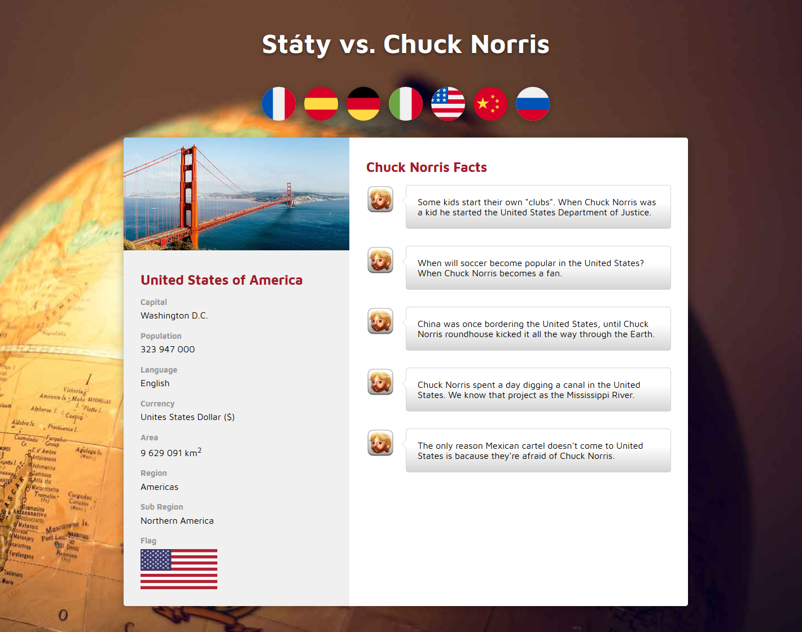
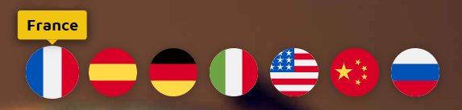

# Úkol 12 - Státy vs. Chuck Norris

Vytvoř stránku, která ukáže základní údaje o vybraném státu a zároveň zobrazí "fakta" o [Chucku Norrisovi](https://www.lifewire.com/best-chuck-norris-memes-4162016) spojená s touto zemí.

Tento úkol je zcela volitelný. Není třeba ho nikam odevzdávat, udělej si z něj, co tě bude bavit nebo co si chceš procvičit. Na tomto úkolu si můžeš vyzkoušet rozdělování kódu do modulů, psaní javasciptových tříd, čtení JSON dat ze souboru, komunikaci s APIpomocí fetch, promises, Promise.all, async/await, práci s polem a aktualizaci obsahu stránky pomocí DOM vlastností.

**Obsah:**
- [Co budeš potřebovat](#Co-budeš-potřebovat)
- [Zadání úkolu](#Zadání-úkolu)
- [Instalace startovního balíčku pro úkol](#Instalace-startovního-balíčku-pro-úkol)





## Co budeš potřebovat

API pro základní informace o různých státech - [REST Countries](https://restcountries.eu/).
API pro vtipy o Chucku Norrisovi - [ChuckNorris.io](https://api.chucknorris.io/).

Obě API jsou zcela otevřená a nepotřebuješ se k nim registrovat nebo se proti nim autentifikovat.


## Zadání úkolu

Z úkolů udělej, co chceš - klidně jen první část se zobrazení vlajek. Ale vyzkoušej si pokud možno alespoň něco. Při zpracování zadání se pokus rozdělit kód do samostatných tříd v odděleným modulech, které pak naimportuješ do hlavního programu a budeš je tam používat.

Doporučuji rozdělit kód na 3 třídy/moduly:

* **Flags** - třída pro načtení a zobrazení řádku vlajek, na které půjde klikat.
* **Country** - třída pro načtení a zobrazení detailu vybraného státu po kliknutí na vlajku.
* **ChuckNorris** - třída pro načtení a zobrazení vtipů s Chuckem Norrisem pro vybranou zemi.

Opět platí, ptej se na cokoliv. Však už víš. Tak tentokrát svůj stud konečně překonej a opravu se zeptej :) Tak pojďme na to:


### **1. Zobraz seznam vlajek**

Když se podíváš na soubory ve startovním balíčku pro tento úkol, tak uvidíš, že je tam i složka `/data`, ve které je soubor `countries.json`. Uvnitř najdeš seznam 7 zemí v JSON formátu. Ke každé zemi je tam název, identifikátor ve formě mezinárodního Alpha-3 kódu, cesta k souboru ikonky s vlajkou a cesta k ilustračnímu obrázku.

My jsme dosud používali `fetch` pro čtení dat z nějakého internetového API, ale jde použít i pro načítání dat ze souborů (data, texty, obrázky, apod.).

Fetch použij naprosto stejným způsobem, jak jsi zvyklá (tj. vrátí promise, až je splněná, je potřeba odezvu převést na JSON a teprve potom máme skutečná data). Jen místo adresy API v internetu uveď cestu k souboru, který chceš načíst.

Naše aplikace při spuštění pomocí `npm run server` běží z lokálního webového serveru, takže nejlepší je uvádět cestu k souboru od kořenové složky tohoto webserveru, tj. `/data/countries.json`.

Celý fetch tedy bude vypadat nějak takto:

```javascript
fetch('/data/countries.json')
  .then(response => response.json())
  .then(data => {
    // v data máme obsah souboru
    // můžeme s ním dále pracovat
    console.table(data.countries);
  });
```

Snad už jsi to sama zjistila před chvilkou při pohledu na data, ale všimni se, že pole zemí není přímo v proměnné `data`, ale až v `data.countries`.

Tento seznam zemí budeme používat jako jakýsi konfigurační seznam pro naši aplikaci. Toto jsou země, které chceme, aby naše aplikace ukazovala. Data si samozřejmě můžeš libovolně upravit a doplnit si tam další země, jen si pak budeš sama připravit i ilustrační obrázek pro danou zemi (vlajky nemusíš, pro všechny státy je najdeš ve složce `/images/flags/`).

Tvým úkolem je vypsat dovnitř prvku `<div id="country-list">` seznam zemí. Pro každou zemi v seznamu použij následující HTML šablonu:

```html
<div class="country-list__item">
  
  <div class="country-list__name">
    France
  </div>
</div>
```

Zroj obrázku, jeho atribut `alt` a název země doplň z načteného pole. Když vše uděláš správně, měl by se seznam zemí ukázat jako řada ikonek s vlajkami. Při najetí myší na ikonku by se nad ní měl ukázat název země.



Předpokládám, že

### **2. Přidej reakci na kliknutí**

Na ikonky s vlajkami přidej *event listener*, který bude reagovat na kliknutí. Po kliknutí na vlajku budeš potřebovat data o státu, kterému vlajka patří. Musíš si tedy do prvku, který jsi vypisovala do stránky v kroku 1 přidat ještě **data attribut**.


*...dopíšu*


## Instalace startovního balíčku pro úkol

Instalace balíčku probíhá stejně jako u startovního balíčku v hodinách. Postupuj podle návodu dole nebo si obsah tohoto repozitáře stáhni jako ZIP a rozbal u sebe na disku.

### Postup při zakládání nového projektu

1. Vytvoř si na svém GitHubu nový repozitář a nějak si ho pojmenuj (např. *ukol12-chuck*, apod.).
2. Při vytváření repozitáře **nezaškrtávej** volbu *Initialize this repository with README**.
3. Objeví se tvůj nový prázdný repozitář, kde máš hned na úvodní stránce několik možností. Vyber poslední z nich **Import code from another repository** - klikni na tlačítko **Import code**.
4. Na následující obrazovce do pole **Your old repository’s clone URL** zadej `https://github.com/lrolecek/javascript2-ukol09-staty-vs-chuck-norris` a klikni na zelené tlačítko **Begin import**.
5. Chvilku to potrvá, ale nakonec se objeví hlášení, že je vše hotovo. Kliknutím na odkaz se jménem tvého repozitáře ho otevřeš.
6. V repozitáři s naimportovaným kódem klikni na zelené tlačítko **Clone or download** a vyber volbu **Open in desktop**, aby se ti repozitář zkopíroval k tobě na disk.
7. V aplikaci GitHub Desktop kliknutím na **Open in VS Code** otevřeš složku s projektem v editoru.
8. V editoru otevři terminál (příkazový řádek) - klávesovou zkratkou `Ctrl ~` nebo v menu volbou `Terminal > New Terminal`.
9. Spusť `npm install`, aby se ti nainstaloval Webpack, Babel, a vše potřebné.

### Práce na projektu a spouštění

1. HTML a CSS upravuj v kořenové složce projektu v souboru **index.html**
2. JavaScript edituj uvnitř složky **/src**, výchozí soubor se vždy jmenuje **index.js**, ale podle potřeby můžeš vytvářet další *.js* soubory a do indexu je importovat.
3. Pomocí příkazu `npm run serve` v terminálu spustíš sekvenci příkazů, která zkompiluje tvůj zdrojový kód, spustí lokální webový server a otevře tvůj projekt v prohlížeči.
4. Webový server automaticky čeká na jakékoliv změny v javascriptovém kódu. Pokud v editoru upravíš svůj program, proběhne automatická kompilace a samo se obnoví okno prohlížeče. V případě, že budeš měnit HTML nebo CSS, musíš obnovení okna provést ručně.
5. Běžící server v terminálu ukončíš stiskem `Ctrl C`.

### Sestavení projektu - build

Lokální webový server pro vývoj (viz. výše) kompiluje zdrojový kód pouze do paměti počítače a výsledné soubory nikam neukládá. Pokud bys chtěla dokončený projekt vystavit někam do internetu, musíš projekt tzv. **sestavit** (build). Postupuj následovně:

1. V terminálu zadej příkaz `npm run build` - to v projektu vytvoří složku **/dist**, do které se umístí zkopilovaný javascriptový kód.
2. Na webhosting dle tvého výběru zkopíruj:
   - soubor **index.html**
   - soubor **style.css**
   - složku **/dist**
   - další soubory a složky, které tvůj projekt používá (obrázky, fonty, další HTML nebo CSS soubory, apod.)
